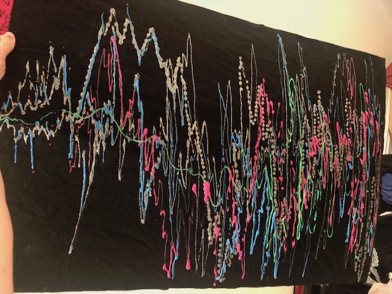

# Me, My Data

## My Data Visualizations

### *Postcard* 

_My averaged music listening habits (Over a 24 hour period)_

I mapped the times of day when I most thought about music or wanted to listen to it. My Spotify data shows my listening times over a typical 24 hour period based on my aggregate music-streaming habits over the past year. I drew a line graph based on this data on posterboard the size of a postcard which I covered in black fabric. I drew on the fabric with glitter glue and fabric paint and indicated times of day with Roman numerals. 

I also tried to map out when I was inspired by color/visuals during the day, in a musical sense. For example, when I saw a bright bouquet of flowers at the farmers market, I noticed I felt musically inspired. I came to the conclusion that it would make sense for me to document these moments of color-induced-musical-inspiration at an art gallery or museum.

### *Poster*

_Visual Interpretation: [Bill Evans, "Like Someone in Love"](https://www.youtube.com/watch?v=QFoapxPvZy4&list=RDQFoapxPvZy4&start_radio=1)_

I listened to the song (four or five times) and interpreted the cadences of the melody, and how the song made me feel on an emotional level with an abstracted line graph over the course of the length of the song. I expressed the melody and how it made me feel; how I interpret the melody in terms of movement and rhythm. 

I also incorporated rhythm by illustrating the song with the texture of the line. Looking closely you see some of the silver glitter paint is actually drawn with dots to emphasize and accent the rhythm. 

I wanted to illustrate the song through fabric for a fashion-like aesthetic, to express the melody as a pattern found somewhere that it normally wouldn't be. 

I enjoyed making it more abstract and trying to emphasize the rhythm and melody with multiple colors. I'd like to try it again with other songs, genre's of music, and/or songs with more instruments. 

## Inspiration

### *Stuart Davis*

_Hot Still-Scape for Six Colors - 7th Avenue Style (1940)_

Stuart Davis was one of the first American artists to consider jazz and swing to as the musical counterpart to abstract art. Davis explained, "[It] is called Hot [a jazz term] because of its dynamic mood" akin to the energy and improvisation in jazz music. The six colors "are used as the instruments in a musical composition might be, where the tone-color variety results from the simultaneous juxtaposition of different instrument groups." I especially like the approach used by Davis of illustrating the rhythm and expression of different instruments with different colors. I like the concept of a multicolored painting which expresses a song's instruments as a visual collage. 

He worked with the idea of combining the senses and incorporating the movement and rhythm of jazz into his visual work. 

### *Shannon Novak*

According to art historian Gregory Minissale in his article [_Topoligcal Diagrams_](http://drainmag.com/topological-diagrams/?fbclid=IwAR1Fv1jNcyFHHbj4PyOaplEag5D6UK8aYpgJntMUtHW0yjzZCUyVRXCU9jE) on Novak's installation _The Expanded Gallery, 2017_, "accents create rhythmic pulse patterns in the kinaesthetics experienced by the viewer captured within the language of architecture. The diagram does not represent but helps to produce complex rhythms across brain, body and world."  

He describes a kind of "celestial physics" which has "come down to earth in the form of music" and which "continues to pattern the imagination and various artistic practices that snag its rhythms and proportions." He describes rhythm itself as more fundamental than music, saying that it travels and is translated by the senses into musicality. 

Shannon Novak, _Arrhythmia, 2017_

I especially love the use of stained glass to create this work, as that touches on the aspect of spirituality or "altered consciousness", which I would love to incorporate into my project. Additionally, Novak references his work as a musician in addition to being a visual artist. He is a pianist and discusses how synesthesia influences both his playing and visual art. The angles and flashes of color in Novak's piece are described by Minissale as punctuations of rhythm, like those in jazz.

Minissale also mentions mirror-neurons in this article, "...Novak’s geometric compositions also stimulate edge detection, mirror neurons, mental shape rotation, vertical and horizontal thrusts, chromatic salience and various tensions in figure-ground ambiguities – all of which do not simply function as tools for identifying an image _*...the complexity of audio-visual rhythm arises both as itself and abstract over and above any consideration of melody, motif or story."*_

I am very interested in this notion of rhythm, movement, and "punctuated accents" like those in music expressed visually. Novak has said of his work _"I aim to create worlds that bring the senses closer together."_ 

He designed the stain-glass architectural pieces in tandem with a piano performance he also did in the location - creating a sort of "set design", or theater of visual art around the music performance, which expresses synesthesia.

I also learned about the term "Gesamtkunstwerk", which is referenced in this article, relating to how Novak aims to express art which unifies the senses. 

Gesamtkunstwerk is a German word literally translated as "a total artwork"; it is a work that makes use of all or many art forms or strives to do so. Wagner, the 19th century German composer coined the term as a description of the opera being the ultimate artform as it combined theater, literature, music, and set design.
 
The concept of Gesamtkunstwerk aims to reconnect the senses and unify experience to arrive at some kind of "transcendence", explains Minissale. He also references a "well-known study of six jazz pianists by Limb and Braun" which discovered that "when musicians improvise and create spontaneous musical passages their brains’ highly conscious analytical and rational planning areas associated with the ‘executive’ system are deactivated. Limb and Braun suggest that this deactivation “may be associated with defocused, free-floating attention that permits spontaneous unplanned associations and sudden insights or realizations…to arrive at a solution without reasoning.” And this deactivation, they report, is also _*‘responsible for altered states of consciousness such as hypnosis, meditation or even daydreaming’.*_

I am very inspired by the work of[Shannon Novak](http://www.shannonnovak.com/works). He explores synesthesia and the connection between visuals and music often in his work, and I find it very striking.

_Bound installation_ by Shannon Novak 

_Kandinsky – Im Schwarzen Viereck_

_Kandinsky – Kleine Freuden_

