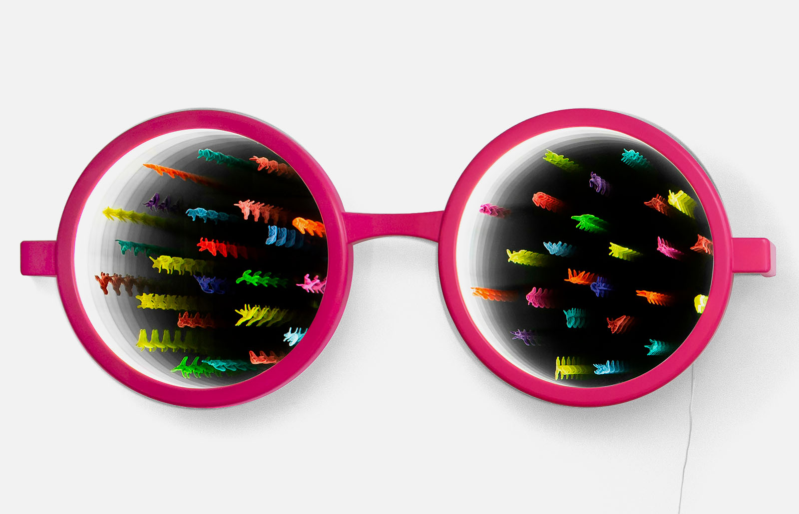

# Major Studio 1: Final Project, Research Question Research

## How can I create a piece of art that makes Americans feel unified rather than red or blue (political identity tribes)? 

The way that the U.S. is so divided politically is something I would love to address in order to promote harmony, and to re-humanize Americans on both ends of the political divide. I’m really inspired the work by JR “Guns in America” that I worked on representing last year, and I would really like to make something that is like a pastiche of that piece. I like how it is multi-modal (static images and video) and was presented as a projection on a large scale as well as on the cover of a magazine (and as a centerfold).  The TIME website also featured it as an interactive site, where you could click on the individual images in the mural to hear the audio recordings.  If I could create something in any way similar, I feel that the issue of almost blinding partisanship in the U.S. is something that artists could really help to address. I personally feel challenged by this issue and am very concerned about the political situation in the U.S.

I would like to make something that encourages people to see each other as fellow Americans, and to re-humanize each other and to love others.  The colors of red and blue could be used to symbolize the two-party system. I’d like to create something that makes people reconsider and rethink any habitual “othering” that they may do to other Americans, which we are perhaps being encouraged to do, and see each other as the same, Americans. I’m particularly concerned about America and our political party identities being encouraged to fight and be pitted against one another. This idea could also apply to an international level and breaking down boundaries and borders to re-humanize those seen as “other.” I’m also legitimately afraid of Right Wing/conservatives in the U.S and the idea of touching anything brazenly political makes me nervous, but one of my artistic goals is to be fearless and uncensored. I’m considering if making a political statement in a somewhat veiled, metaphorical way would be better than something as literal as “Guns in America”.

I’m also really passionate about poetry so I’m wondering if a collage of some kind could be created that includes poetry, images, video, and audio. I like the idea of a digital collage. I’m also really inspired by more radical “real-time” protest art. 

[Protest Art in Hong Kong](https://news.artnet.com/art-world/hong-kong-artists-protest-1622485) 

## Music. Color. Emotions. Memory. Synesthesia. How can I tie these into an interactive experience? 
I am also still approaching the questions of synesthesia/music/memory and emotions. This week I practiced meditating to different styles of acoustic music. I think music and meditation are very connected.

I started to think about ways that music is spiritual and how to signify it visually. I envisioned making something like stained glass windows which show colors and patterns (maybe Buddhist mandalas) that change according to different notes or styles of music. I took notes after listening to an acoustic guitar meditation and these were my thoughts:

## Mood awareness: I feel like the music helped me feel more aware of my current mood/state of emotion. I thought about how this was enhanced through meditating to music.

## Hand movements/finger painting: for some reason I thought about how you could interact with something that shows colors/visual patterns to different music but which you control as if you are finger-painting, with your hand movements.

## Color and sound: How do they effect emotions and mood/memory?

I haven’t done yoga or painted to different music but I am curious to see how creative work is different as effected by different styles of music, beats per minute, or having done yoga to different music prior to painting/etc.

## Music as a Religion: and how can I make an artistic statement that “music is my religion?” 
I started to think more about my own relationship to music and why it’s so important to me. I’m a musician, and I was raised in a musical family – but I was also raised by parents who made a conscious choice not to impart any kind of religious values on my brother and I, so I was raised in a vaguely Christian/also Buddhist household.

While I appreciated not having a religion forced on me, I always admired my friends who got to go to a spiritual place. As I’ve gotten older, spirituality has become more important to me. Looking back, I wonder if music took the place of religion for me. So, I started to think about creating a work of art that makes music into a religion of its own. It has scripture (lyrics), preachers (singers), and it has devotees (fans.)

Meditating to music and thinking about music as comparable to a religion, I remembered a poem that I read a few years ago by musician Jack White. I remembered it as “Music is Religion” but it is called “Music is Sacred.” I would love to embody a similar message in a multi-modal work.

Music is Sacred
those of you who stand for the sanctity of music
so that its soul can breathe
and be heard
so that it blooms in graveyards
echoes in hotel hallways
awakens neighbors in the night
and fills people’s minds with fire
shout it out loud with whatever microphone you have
or these stones will shout for you.
jump in front of demons,
and stand over cowards and those who would intend
to rip out your lungs and dampen your desire
tell the living and the dead
what you know in your heart to be true
and what you know your ears
will forever hear
that the melody of the human race
is a song that never ends.
music is sacred.

(You can read the poem “Music is Sacred” in this [Rolling Stone article.](https://www.rollingstone.com/music/music-news/jack-white-pens-poem-music-is-sacred-237531/)

I found an academic book called [“Deep Listeners: Music, Emotion, and Trancing” by Judith Beck.](https://web.stanford.edu/group/brainwaves/2006/Becker-DeepListenersLecture.pdf)The book posits that “both religious ecstatics and “deep listeners” experience strong emotional responses when listening to music they find deeply moving. And furthermore, that “deep listeners” are potential trancers.”  

I think it would be interesting to make a somewhat literal interpretation of this idea of music being sacred, to say “music is my religion.” I’d like to combine that with the healing property of music and visual art therapy and their ties to meditation/religious states of consciousness. I.e. Buddhist mandalas are patterned so that the experience of viewing them puts you into an “altered” state of meditative consciousness. I’d like to create harmony within though interactive meditation via music/images/color.  I also came across these images of water molecule patterns when different music notes are played on a grand piano: https://www.youtube.com/watch?v=9al397N6Tzs

Additionally, there is a strange condition I read about called “musical ear syndrome” wherein you start to hear music when other background noise occurs (like being near a fan) or for no reason. It seems like an interesting and strange thing that could potentially be incorporated somehow into multimodal work featuring music. [Link to article about Musical Ear Syndrome](https://hearinglosshelp.com/blog/apophenia-audio-pareidolia-and-musical-ear-syndrome/)

## Existing Map of Emotions 

The Atlas of Emotions project by the Dalai Llama is an interactive website which charts emotions and how they are related. It states “The first step towards emotional awareness is learning to identify and describe how you are feeling, and why.  The goal is to gain greater control over what triggers your emotions and how you respond. The Atlas is an interactive tool that builds your vocabulary of emotions of emotions and illuminates your emotional world.” The Atlas of Emotions categorizes many (if not all) known human emotions in an interactive way which breaks them into categories according to Budhhist philosophy : http://atlasofemotions.org/

I am curious about creating something sort of similar, but which uses different genres of music, different shapes, and colors associated with different emotions. I’m also curious about synesthesia and Chromesthesia (sound-to-color synesthesia). I like art that is evocative of dreams or surrealism, and I think that those would work really well with these themes.

I also found this article about mirror neurons and triggering emotions through visual art, as used in [art therapy.](https://www.tandfonline.com/doi/abs/10.1080/07421656.2010.10129385)

I haven’t seen any other artist combine color and music to specifically trigger emotions/memory. I did think this was really interesting as well -
I particularly like how this artwork “Vision of the world: Virtual or Real?” By Olga Kosheleva makes the view question their perception of reality and how they see the world through something as literal as giant glasses combined with an optical illusion. I like how simple and straight forward it is yet the use of the LEDs and the mirrors shift perception.

[“Virtual or Real?”](https://olgakosheleva.com/artwork/vision-of-the-world-virtual-or-real/)

## Symbols

I’m also really interested in symbolism and the use of symbols in music, visual arts, and poetry.

## Conclusion

I feel very challenged by both these questions but ultimately think that they're both very important and meaningful to me as well as to others. I want to create something expressive which makes people feel, makes people think, and hopefully stays with them after they leave the work behind. I also feel that the idea of music as the universal language speaks well to the political protest art that I am considering. I want the work to make people feel re-humanized and connected to others through the vehicle of music and visual art in an interactive way which promotes harmony.

