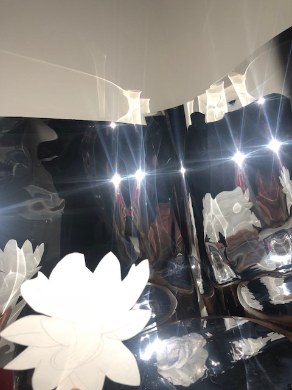
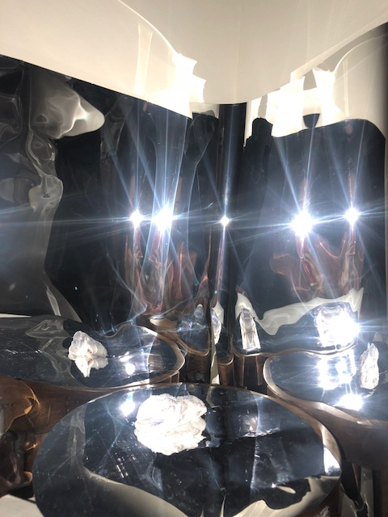
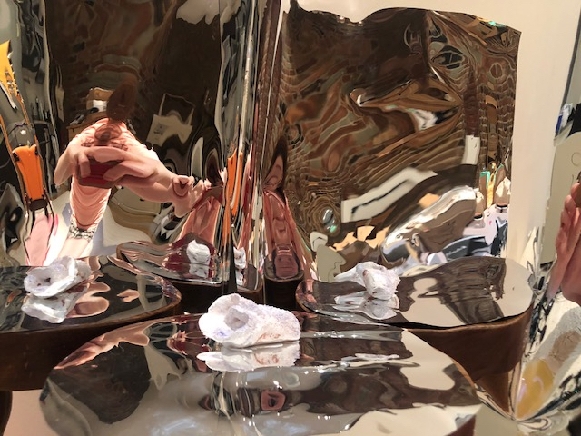
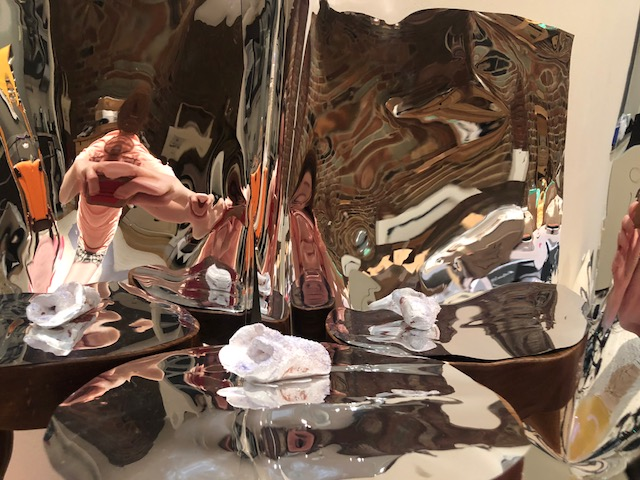
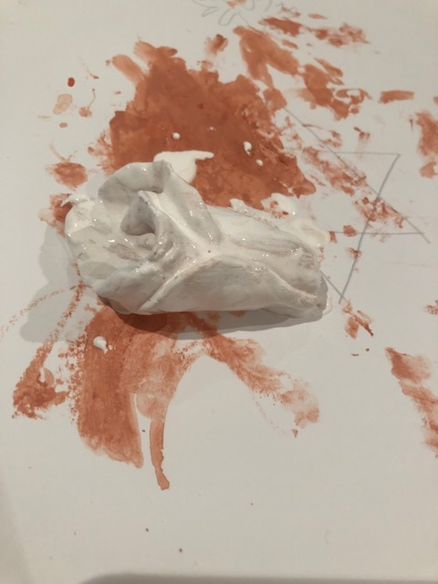

# Seven In Seven 

## Day 4. Protype 4

Today I felt really tired, and am still feeling sick, and I didn't want to play guitar. This has been a really great practice for me to get back into playing. I tried to focus on it being a prayer/meditation and tried to communicate/express that I was trying to connet with a "higher power" and have a spiritual intention while playing. 

Something that came up for me was that it was fun, and that even though I was tired today and didn't feel well, once I started to play it was like all my anxiety and worries were far away. Music really can help me to be transported emotionally, and I was lost in the world of playing, and that feeling is very meditative. It's like an escape and a relief, it gets me out of my head and into my body, just like yoga or dancing. I think that is profoundly spiritual for me. 

I had a lot of anxiety and frustrated energy, and I accessed a lot of anger. I prayed for my anger to leave me and to release it, and I asked for help in my prayer. To feel better, and to not be so unhappy, anxious, and angry.  I was actuallly able to get some of my aggression and anxiety/anger out through playing. This is a huge gift for me emotionally, mentally, and spiritually. 

The hardest thing for me is to break through my perfectionism and my "I suck, I should just give up" because I haven't practiced much in years, and when I start to play and it feels like I'm not able to make my hands do what I want. I get similarly frustrated in Yoga if I"m out of practice and my body isn't doing what I want, or up to the level of skill that I used to be. There are a lot of similarities to me between yoga and guitar practice.

I remembered that I want this expressive art work to reflect the philosophy of Wabi-Sabi and Kintsuki, and that it's okay that it's not "perfect" , and that the "mistakes" can make it beautiful. Like in yoga when you fall, it's about getting back up. I tried to really embrace that and my mistakes/sloppy playing, and it gave me a feeling of freedom and liberation. 

I also once read a book called "The Zen of Guitar" that said that every time you play a note, you should play it with all your heart, like you are crying out to the ocean. I tried to remember that. It would be interested to try to visualize that idea. 

Another thing I thought about is some advice I received from an older musician. I was expressing that I quit playing because of my perfectionism, and putting too much pressure on myself, and because of depression. She said that what musicians admire about you musicially is that you have your own artistic voice, and that the "technical" aspect of it isn't what makes you respected so much as that unique voice. For some reason I remembered this advice and it really stuck with me.

I've been angry and frustrated at my body for being so sick, and I felt like I was actually able to connect to a higher power, or unlock something in myself. I prayed to take my frustration and anger away, and it felt like the energy moved through me by playing - and I felt uplifted and energized, like it had come unblocked in me. 

I would love to relate this to the idea of Gestalt, aesthetically - and in terms of psychology. I felt like it was a music therapy session for me. 

### Musical Prayer #4

[Day IV Guitar Meditation/Prayer](https://youtu.be/XiXVou4XeRg)

### Accompanying visuals, Day #4:

[Day IV Visuals]()

My idea for this day is a sculpture and include it in a theatre-like set design with shadows and the spiritual symbols cut out of paper from my day 2 prototype. I would like to make a sculpture, and then project recorded colorful footage and artwork onto it with a projetor while the music plays. 

Images of water, and other buddhist images and spiritual images relating to creation, waves (sound waves and water), and calming imagery could be projected onto the sculpture. I like the idea of including shadows, mirrors, and light - so it's almost like a diaorama or a small theatre. 

The conch shell is the symbol I chose for the sculpture because it represents sound, creation, and enlightenment in Buddhism.

*Just as we find with fish symbolism, the conch shell is associated with water, thus the esoteric meaning of the conch shell bears some relations to creation. The spiral pattern at the tip of the conch shell represents the beginning of existence. In Aztec mythology, the Creator God Quetzalcoatl produces life by putting bees into the conch shell to make it sound. This is a reflection of vibration that creates the first wave of life.* 

Source: [The Symbolic Meaning of the Conch Shell in Buddhism](https://mastermindcontent.co.uk/the-symbolic-meaning-of-the-conch-shell-in-buddhism/)

This relates to the power that I feel, the creativity, and the way that the vibration of music feels like it connects me to my spirituality. The sound of the conch shell is supposed to make people "wake up" from their ignorance in Buddhist symbolism. When I play music I feel like I escape to another place, where I am not thinking about my worries and it's a relief. In this sense it's like "waking up" from conscious reality into a higher one where I am in the moment.

I made a sculpture with sculpting clay, of a conch shell

Then I painted it white and added glitter.

I put it on a stand covered in mylar and put mylar around it on the walls, to try to create an infinity mirror effect. I used colored cellophane to cover the flashlight like a lense on a spotlight. I also discovered my flashlight has various strobe light effects while doing this prototype, and that made it more interesting visually. I tried to cast shadows onto the sculpture from my hands in the shape of the mudras as well as by holding the paper cut outs of spiritual symbols in front of the light (angel wings, lotus flowers.)

I also filmed the paper cut outs of the angel wings and lotus flowers in the reflective "stage" area next to and in front of the conch shell statue.

