# Final Project

## Visual Music Tarot: Multi-Modal Artistic Expression

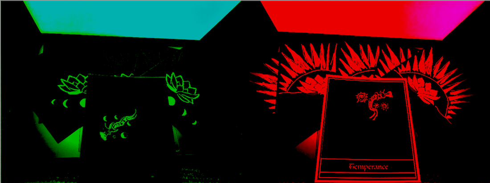

### Final Project Video Demonstration

[Final Project Video](https://youtu.be/aI0XV11hx7A)

### Research and Inspiration/Precedents 

My final project answers the conceptual design question: *“What if music were my religion?”* 

Answering this question formed the conceptual basis for this project. Capturing the spiritual/ethereal nature of music, as experienced by musicians and music listeners, is the impetus for this work. The challenge of this piece was to embody the spiritual facet of music. I wanted to create an artistic expression via a multi-modal (audio/visual) work. 

Synesthesia was initially the inspiration for this work. Synesthesia is a term used to describe a condition where one can see music.  Artists like Wassily Kandinsky, inspired my project and foundational research in the early stages of developing a specific research question which would explore the relationship between music and visual art. Kandinsky, who explored music through painting, is thought to have had the condition of Synesthesia, which “crosses the senses” resulting in seeing music.

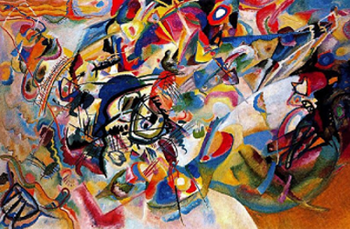

*Wassily Kandinsky's Composition VII, 1913.*

At the outset of the project, I was primarily interested in visual artists who create works inspired by music, or musicians who also create visual art, with the intent of embodying music visually. Stuart Davis, for example, was an American modernist painter who considered jazz and swing to be the musical counterpart to abstract art. He painted how he imagined jazz to look, using different colors to represent different instruments and tones. 

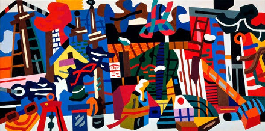

*Stuart Davis, “Swing Landscape’, 1938.*

The concept of "visual music" is closely related to that of Synesthesia and has evolved to become an influential component of contemporary audiovisual art. Historically, the term was used to describe early animation and avant-garde film which aimed to interpret musical scores choreographed to embody musicality through artistic visuals.

I explored the relationship between musicality and visual art by interviewing musicians and surveying music fans. One of the concepts that arose in my early research was the significance of emotions, the senses, and the intangible/ethereal nature of music. This led me to explore multi-modal work related to music and visual art which touches on these themes. My interviews with musicians uncovered the primacy of the emotions and the senses, which led me to reference the Romantic Art movement of the mid-18th century. The work of William Blake, a Romantic poet and illustrator/engraver during the 18th century provided another early example of multi-modal work. Blakes poetry (which could be consid-ered lyrical and song-like) was illustrated with accompany-ing visual art.

I was also interested in multi-modal work, multi-disciplinary creations which unite the senses, and discovered the con-cept of “Gesamtkunstwerk.” Gesamtkunstwerk is a German term meaning “a total artwork or comprehensive work of art.” I was drawn to this idea of Gesamtkunstwerk, or art-works which combine different art forms and disciplines. 

A visual artist and pianist who creates multi-modal work related to audio/visual experiences who inspired me was the artist Shannon Novak. Novak created stained glass windows which expressed the movement of music visual-ly, in a space where he then performed a concert. By creat-ing this visual environment which illustrated the music, the musician provided the audience with another sensory experience and visual art container in which to experience and remember the music performance. 

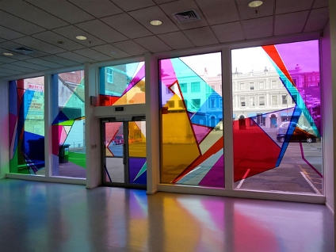

*Shannon Novak, The Expanded Gallery Central Installation -Dunedin Public Art Gallery, New Zealand, 2017.*

Additionally, I was inspired by album cover art and interactive album art, which allows music artists to reach fans through the unique canvas of album packaging. For example, the 1967 album cover by The Velvet Under-ground featured a peel away sticker to reveal another image beneath the first version of the cover, exposing another bright layer of an Andy Warhol painting. 
 
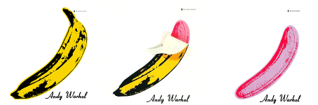

*1967 Velvet Underground album cover featuring peel away sticker revealing additional art by Andy Warhol.*

Beck’s 2007 album, *The Information* came with stickers and graph paper, giving fans the opportunity to create their own DIY album art at home while listening.
 
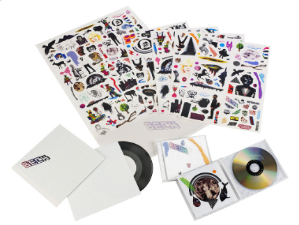

*Beck’s 2006 album, The Information, allowed fans to design their own album art with stickers.* 

The use of light in this project is representative of spirituality and the intangible, ethereal aspect of music I was trying to convey. Light as a medium can represent and communicate the themes of enlightenment, illumination, and spirituality. 
	
The inspiration and precedent for animation using a computer screen as a light source, illuminating correspond-ing colors to create an animated effect, came from a project entitled “Midnight Animation.” 

[Precedent: Midnight Animation](https://youtu.be/XZEae0Qnn0Y)

Work’s by artists like Mary Ellen Bute and Oskar Fincher in the 1930’s, and the genre of early modernist animation also became an inspirations for the visual components of my project. Bute in particular created visual music choreographed to accompany musical scores and worked with light as an artistic medium, in addition to animation and film. 
 
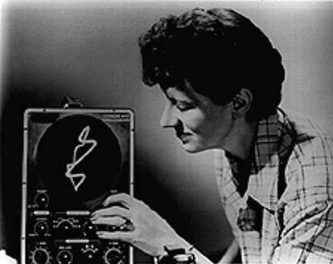

*Mary Ellen Bute, early animator, filmmaker, and light artist.*

The work of the Fluxus art movement, which was composed of musicians and artists began in the 1960’s, and continues today. The Fluxus movement was another inspi-ration for this project. The movement’s artistic output is described as entailing, “informal, spontaneous, and often ephemeral pieces…”

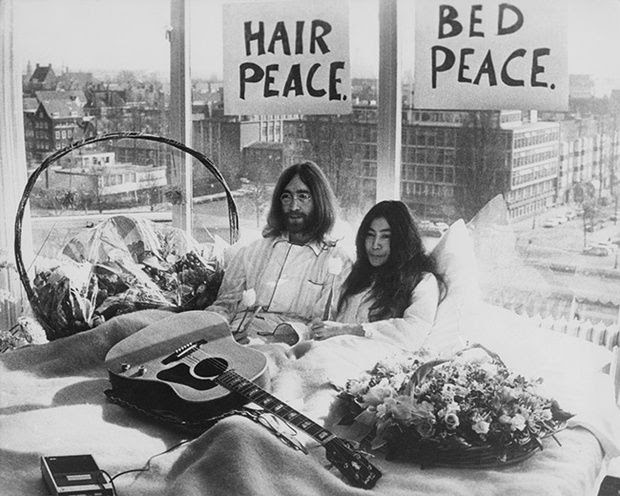

*Yoko Ono of the Fluxus art movement with John Lennon*

### Phases of Project Creation

The aim of this project was to explore the relationship between visual art and music, specifically illustrating the intangible/spiritual aspect of music through a multi-modal, audiovisual form. I attempted to answer the guiding conceptual research question: “What if music were my religion?” beginning with my Seven-in-Seven project. 

For the Seven-in-Seven project, I attempted to answer this question from a personal, artistic perspective. Each day, I played guitar as an improvisational meditation or prayer. In improvising music during these sessions, I tried to incorporate the Japanese philosophy of Wabi Sabi, which holds that imperfection is beautiful. Based on the guitar playing sessions, I created corresponding visuals in the form of seven experimental videos to go along with each music recording. Each guitar playing session inspired different symbols and visuals which I created experimental videos for, and applied the music to as a soundtrack. 

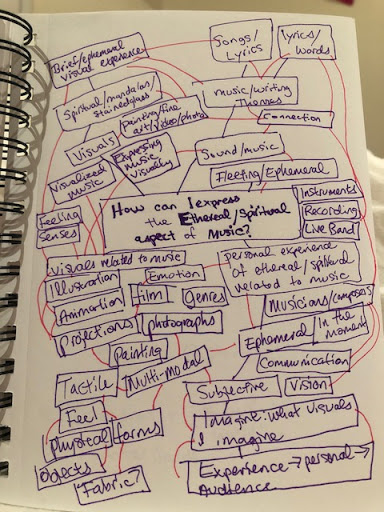

*Mindmap brainstorming exercise*

This led me to create an interactive experience for a music listener, which would entail a multi-modal (audio/visual) experience. I set out with the idea of an illustrated book of spiritual symbols which could be flipped through while listening, as an accompaniment to the music. After first creating a booklet, it felt like too constrained a form. I finally settled on creating tarot cards, to use as a divination tool while listening to the music. This form felt less constrained and more free. The divination tool of tarot cards tied in more directly to the conceptual theme of spir-ituality. I aimed to engage multiple senses and to create an accompanying visual art experience to complement a piece of music to be enjoyed in tandem by a listener. The idea of delivering an artistic visual experience via the canvas of album art or album packaging, to complement music, is what I had in mind. 

In the words of neuroscientist Dr. Jay Lombard in his book, *The Mind of God,*

  *“The defining characteristics of the mystical, reli-gious, and wondrous encounter is its sheer ineffability. What is “worship” except our feeble attempt to express what cannot be expressed?...Surely we are tapping into the intangible then. We have come to the limits of our language and have experienced something beyond language.”*

I set out to create an illustrated book of imagery which would express some of the spiritual symbolism which I envisioned during my meditative guitar sessions, in order to deliver a multi-modal (audio/visual) experience. Initially these symbols were going to be more abstract or undefined shapes. When I changed to tarot cards as a form, it felt more appropriate to choose cards related to my experience of playing guitar as a meditation/prayer. I selected six cards to illustrate which related to concepts like balance, practice, inspiration, love, and excitement – all feelings I experience related to music. I illustrated the tarot cards: The World, The Hermit, The Star, Temperance, The Ace of Wands, and the Knight of Cups. 

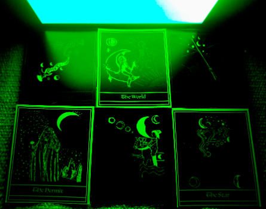

*Green (moon designs) of tarot cards*

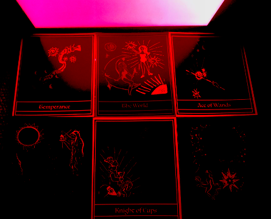

*Red (sun designs) of tarot cards*

To create the animation effect, I did one design of each tarot card in red and one in green. The red design version included symbols of the sun and the green version included the moon. The back of the card features a lotus with either a sunset or moons, depending on the color of the light shown on it. Using Processing, I created code which transformed the laptop screen into a light source alternating between pure red and green, to illuminate the illustrations on the cards. This took multiple iterations, in order to get the light source colors and coding for this effect right in terms of color and speed. 

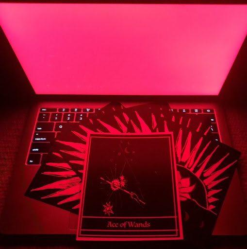

*Red (sun) version of Ace of Wands card*

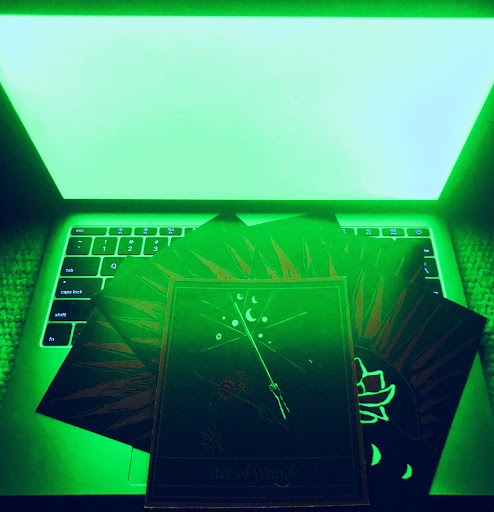

*Green (moon) version of Ace of Wands card*

Additionally, I drew multiple versions of designs and had to print out various designs and test them to make sure that they were fully illuminated by the light source. I had to adjust the colors I was illustrating with multiple times to achieve pure RGB colors, so that the animation effect would work correctly. The symbolic significance of the sun and the moon, is described by comparative religion and mythology scholar Joseph Campbell:

  *“the shift of the order of your consciousness from identification with the reflected light in the moon, to iden-tification with the solar orb—this is the moment when you are in full consciousness and you can ask yourself—Who am I? Am I this body which is the vehicle of the con-sciousness, or am I consciousness? This is the theme of all the mystery cults. This is the theme of all the great high myths of vision and realization.”*

Below are some examples of the early tarot card designs:

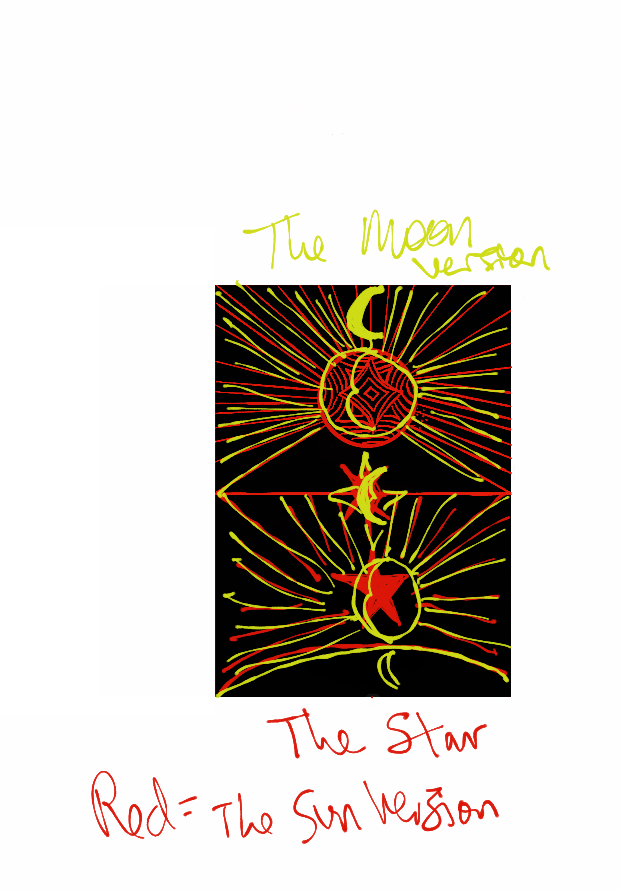

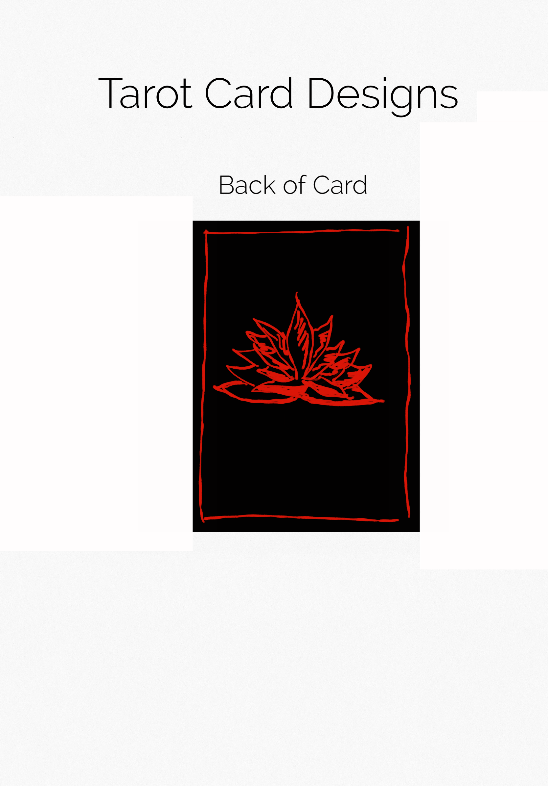

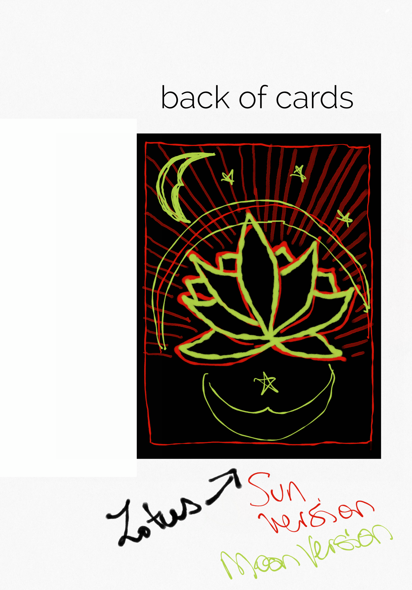

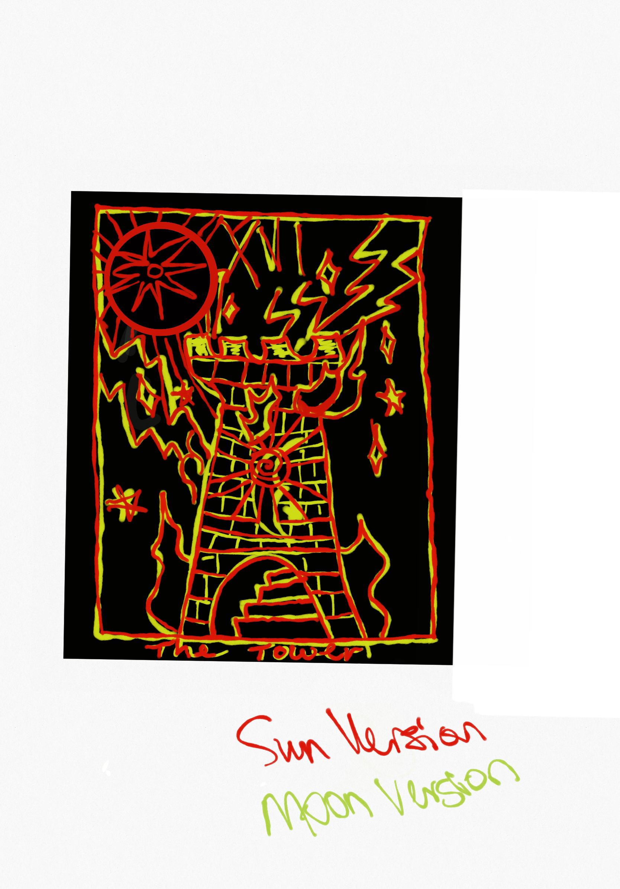

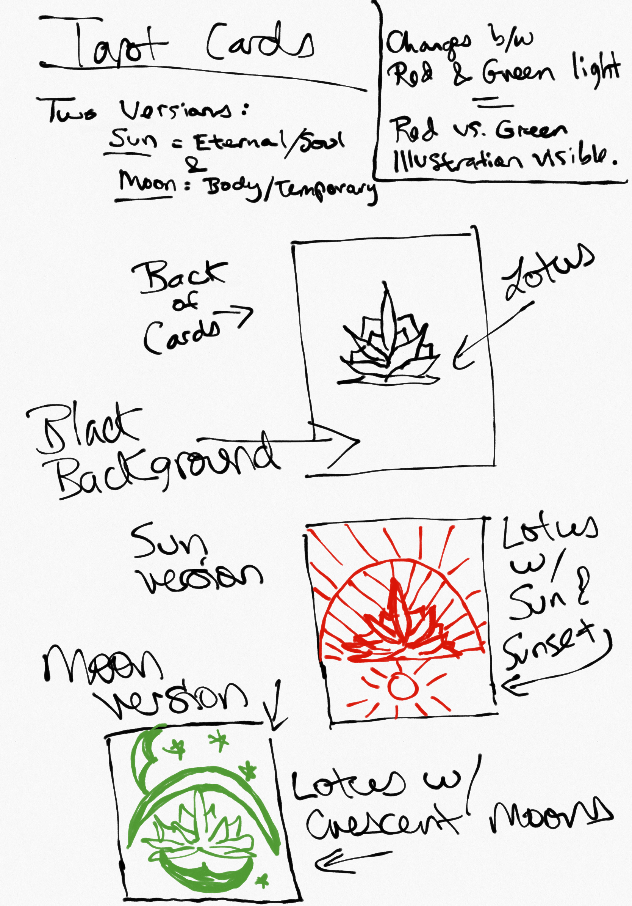

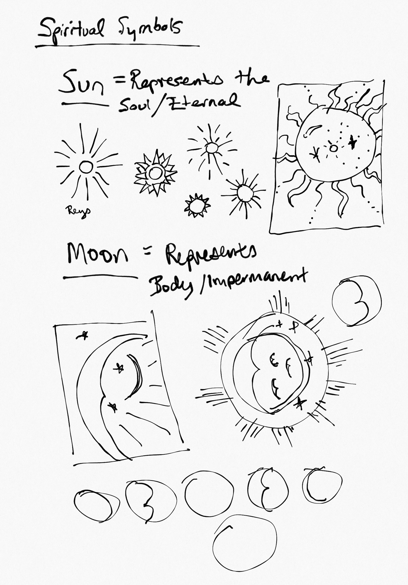

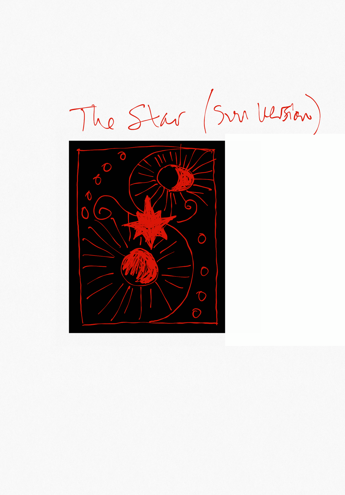

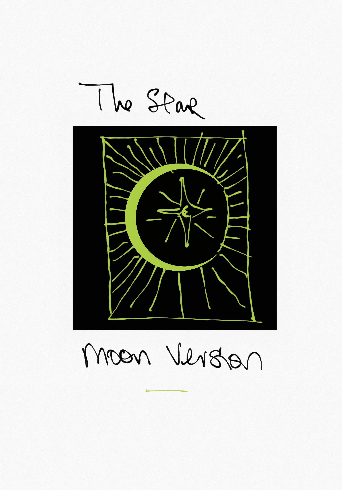

The music I ended up creating for the project is my cover of the song, The Suburbs by The Arcade Fire. I played, recorded, and produced the piece in Ableton. This song is about the concept of home and impermanence in many ways, and I think it ties in with the spiritual con-cepts I was seeking to highlight. I used a lot of delay in production to make the two guitars have a dreamy swirling quality which complements the magical, mystical experi-ence of a tarot reading. 

The use of the tarot cards allows the listener to experience a different outcome and combination of cards every time they use them, which produces an ephemeral effect. Tarot allows the user to listen to their own inner wisdom and interpret the cards in their own way, which is similar to the way listeners experience and interpret music uniquely as individuals. The animated tarot cards create an inter-active visual music experience which incorporates divina-tion and light, to accompany the music listening experience. 

### Conclusion

I achieved my goal of creating a multimodal, audio visual, artistic expression which unites the senses. I was eager to experiment with coding, animation, illustration, music production, and the concept of visual music. One challenge that I concluded is unavoidable is that the RGB light source from the computer creates an imperfect animation effect, because the amount of light that it pro-vides with either color does somewhat illuminate the op-posite color. For this reason, if I continue to experiment with animation created by light effects, I would try to find a way to make it more high-contrast and perhaps experi-ment with different forms of light or different ways of animating illustrations. I was excited to discover a new genre, early modernist animation – and I particularly enjoyed getting to explore illustration and drawing to accompany my music. This is definitely a path I want to continue on artistically. I am strongly motivated to create work related to visual music, album art, multi-modal audiovisual productions, and illus-tration/animation-based work.

I learned that iteration is extremely important, not only to achieve the technical goals of a design, but to create a strong conceptual foundation to guide the project. Ultimately, I was excited by the animation effect I was able to achieve using illustration with pure red and green colors and the illumination of colored light from the coded effects on the computer screen. I enjoyed drawing the illustrations and creating the animation effect and getting to work with code in a creative way related to music and visual art. I would like to create an entire deck of tarot cards in the future with original designs. I am strongly motivated to continue working in the area of visual music and am moti-vated to create visual art to accompany my music. In the future, I would also like to incorporate my love of poetry and lyrics with an audio-visual art production.

