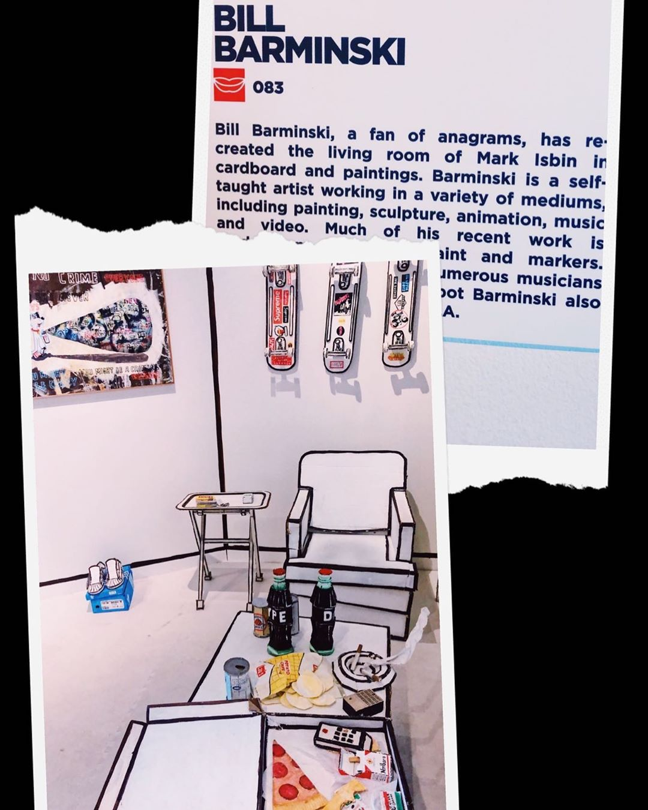

# Instruction Sets for Strangers

## Research for Tompkins Square Park Location

We chose Tompkins Square Park on the Lower East Side as the location for our project. The park has a rich social history; Since its beginnings in the 19th century, Tompkins Square Park has served as a home for New Yorkers to voice their political dissent. In 1857 and 1875 residents protested job scarcity and the poor economy. In the 1980’s and 90’s, local residents protested gentrification.

Built in 1888, the Temperance Fountain was built by The Lower East Side’s Moderation Society (a group formed in the 1870’s to address the health conditions plaguing this dirty, crowded area of NYC.) Prohibition of alcohol was paramount to these reformers. After the Civil War, temperance groups like the Moderation Society constructed public drinking fountains with the belief that providing a free, clean, and readily available alternative to alcohol would prevent alcohol use.

### Harry Greenberg Memorial Tree

### Slocum Memorial Fountain

Dedicated in 1906, the Slocum Memorial Fountain in Tompkins Square Park is a tribute to those who lost their lives aboard the ship General Slocum on June 15th, 1904. 

## Guiding Questions

### What is the definition of a stranger? 

We are defining "stranger" as a person in the park for this project.

### How do strangers communicate? 

Speaking, laughing, discussing, touching, gesturing, moving, making sounds, making expressions.

### What are effective methods for observing and documenting activity and  interaction between people and groups?

Observing, writing about what you see, experimenting with prototypes and seeing how people react and interact with different items and prompts. 

### What design and narrative strategies exist to help in the design of non-textual interfaces? In other words, how do you show, and not tell, behavioral prompts?

Keeping the audience in mind and providing affordance through design; maximizing visual prompts without using words or explicit instructions.

### Brainstorming and Mindmapping 

### Mapping the space and observing patterns 

We found a unique location near the dog park which features a cement ping-pong table. We observed and mapped the activities of the people surrounding the ping-pong table area. 

### Deciding on Our Goal

We decided that the ping-pong table provided a good opportunity for interaction with park visitors. We went through a series of different ideas of how to repurpose or utilize the intended function of the table. We started off with the idea of covering the surface of the table with canvas or paper and painting it with bright colors to look like the solar system. We thought that using glow in the dark paint to paint the milky way and solar system would be interesting, and we floated the idea of using different sized ping-pong balls to represent different planets. We also talked about putting lights in the balls and making them light up. 

### Changing the Function of an Existing Form

We then discussed turning the ping-pong table into a canvas, and giving players the opportunity to dip the ping-pong balls in paint so that when they play the game, they are creating paint strokes. We decided that this would get unruly and hard to manage, especially with the potential of kids being involved so we decided to do something less messy.

### Repurposing the Ping-Pong Table's Role

The idea of using the ping-pong table as a formal dining table is what we landed on. We liked the absurdity of setting a formal dining table, as if at a fine restaurant, in the middle of the park. We hypothesize that people will be drawn to a table-setting, and will want to take pictures/play with the items on the table. It reminded me of Judy Chicago's "The Dinner Party" and the "Cardboard Living Room" by Bill Burminski. We want to make it playful, and will make the items out of cardboard/paper mache, and other items so that it is somewhat "larger than life."

### Beginning Prototype Sketch

### Inspiration Exhibits

"The Dinner Party", by Judy Chicago, Brooklyn Museum 

### "Cardboard Living Room" (Beyond the Streets exhibit), by Bill Barminski

