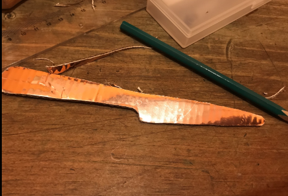
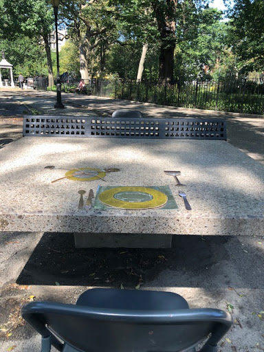

# Prototype Test I 

###Findings: Prototype Test I notes and documentation.

**The questions we set out to answer during our first prototype were:**

-Are we using the right materials (cardboard)? 

-Will the setup prompt attention and engagement if we include chairs (an affordance to sit) at the “dining table”? 

-What is the optimal day of the week and time of day for stranger interaction? 

**Our planned interaction:**

-Strangers will notice, stop, and sit in the chairs at the table.

-Sit to play with and engage with the installation.

-Stop to take pictures of one another with the installation.

-Talk to each other.

[Prototype Test I Footage](
https://drive.google.com/file/d/1_HcqHmJrMhzm2GlPKin2euVE_hietx5c/view?usp=sharing)

### **Test Findings**

**Form**

In relation to the size of the ping-pong table the props looked too small. More than two table settings would be too time consuming. 2D form is not enough to prompt engagement.

**Optimal Time**

Work hours/weekdays are not optimal for engagement from strangers. 

**Material**

Cardboard is good for 2D form but may need to be supplemented with additional materials for 3D props. 

The chairs should be the same material/painted the same way as the rest of the props in order to create a more uniform installation appearance. 

**Setup**

Kids near us were very interested in the shiny creations while we were making the 2D props.

Music being played from an iphone was helpful in attracting attention and engagement.

### **Future Improvements**

**Form**

Increase the size of our props significantly (3-4x bigger than the size of dishes in reality. The concept changed from formal dinner to romantic date (for just two people.) Update the form to 3D. 

**Future Updates to Optimal Time**

Test on weekends(more couples, families, children, and groups of friends on Saturday instead of single people. )

**Materials**

Use paper-mache in addition to cardboard and other methods for 3D to create “oversized” props. 

This emphasis the affordance to sit suggested by the chairs, which we believe will improve attention and engagement.

**Setup**

We want to maintain the shiny/reflective aspect of the form. Bright colors will be more attention grabbing than neutral metallics. Making a reflective, mirror-like surface to cover the table will create playful reflections. We will need a wireless speaker which can provide music at a higher volume. 

**Conclusion**

-The metallic, shiny, neutral colored 2D props invited curiosity and attention. 

-The installation did not appear as enough of an eye-catching spectacle to generate very much engagement.

-We saw a higher attention rate after we started playing music (jazz for a date-like ambiance) from an iphone on the table. 

-The chairs set up at either end of the dining table sparked attention from people walking by, and brought people’s eyes to the table setting. 

In summary, we found that 2D cardboard props were too hard for people to distinguish and that as a whole, the installation did not appear as enough of an eye-catching spectacle to generate very much engagement. The jazz playing from the iphone significantly increased attention and drew more engagement with the table. 

**Further inspiration**

After our prototype I test, we were reminded of the performance art piece by Marina Abramovic called “Sitting with Marina” at the Museum of Modern Art in 2010. In the show the artist sat motionless for seven hours at a time, and looked into the eyes of museum visitors sitting across from her at a table until they felt some kind of connection or reaction.

Marina Abramovic, “Sitting with Marina”, 2010.

