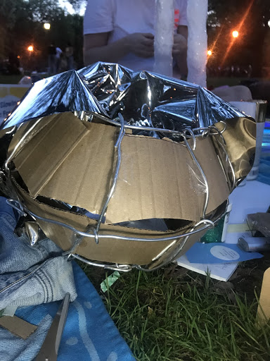

# Prototype Test II

## Findings: Prototype Test II Notes and Documentation

[Prototype Test II Footage](https://drive.google.com/a/newschool.edu/file/d/1Nz5iqj0qb5GbPiJ6AudZ57LmWn1qfuNE/view?usp=drivesdk)

For Prototype Test II we crafted giant candles out of cardboard, clay, wire, and iridescent plastic. 

We painted the candles with acrylic and covered them in glitter, and placed strands of fairy lights (similar to Christmas lights) powered via remote controls inside the flames. Flames were made of clear plastic glued to the wires shaped into flames to hold the light strands.

We also created a large "vase" out of wire, covered in reflective, mirror-like mylar film. We made giant placemats covered in mylar as well. The speaker was hidden in the vase and covered with red cellophane (to mimic roses in a vase).

### Prototype Test II: Phase A

**Primary reactions/feelings we are targetting:**

*Emotional*

*Playful*

*Explorative*

*Reflective*

The installation evokes emotions through a surreal scene encountered as an interactive, dreamy experience. The formal dining table setting is meant to bring to mind sentimentality, intersocial communication, and social connection. The table for two highlights relationships between people and relationships. 

The musical experience is carried by jazz playing from a hidden wireless speaker, specifically the song "Old Devil Moon" by Chet Baker, with lyrics mentioning two candles. Music sets the ambiance of a romantic date and invokes a calm, relaxed, pleasant emotional state. The music is also an homage to the rich jazz history of the location; jazz icon Charlie Parker’s home is a historic landmark on Avenue B, adjacent to the park.

We want the stranger's interaction with the experience to be led by curiosity and explorative instincts. The surprise of igniting the other person’s candle (on the opposite side of the table) is meant to deliver a whimsical, funny, unexpected experience through discovery. Including large, oversized objects invites users to stop and investigate an alternate reality by sitting, looking at, and touching the items on the table.

**How do we initiate interaction with the user?**

We left one of the candles lit, and turned the other candle off, so that users would be attracted to the lights and see that there was the possibility of turning them on or off. This also offered the affordance and opportunity to discover how to light or turn off the candles. 

A hidden speaker inside of the vase playing jazz drew strangers to the table to investigate and stop to explore the scene. The lights and white tablecloth and chair coverings made the overall appearance of the scene eye-catching and highly noticeable to strangers from very far away (as we were told by strangers.)

### Prototype Test II: Phase B

**What role does the form play in initiating the desired interactions?**

-The original “game-play” function lingered as an influence. 

-Chairs offer the affordance of sitting at a dinner table. (new)

-Remote controls give the affordance to pick up and press buttons.. 

-The music beckons strangers to stop and explore the table. 

-The reflective surface magnifies the lights. (new)

-The jumbo scale candles coated in glitter are highly visible and reflective.

-Leaving one candle lit sparks curiosity.

**A Few Notes on Form and Function**

Changing the function of a ping-pong table (game) to a formal dining table makes people consider the scene with the context of the original “game-play” function lingering as a subtle influence. 
Chairs placed at the table suggest the new function of the form and offers the affordance of sitting at a dinner table. Placing remote controls on the table (on top of lights shining from underneath the table cloth) in front of each chair gave strangers the affordance to pick up the remote and press buttons to discover what happens. 

The music coming from a speaker hidden in the vase beckons strangers to stop and explore the table. 
The reflective surface of the mirrors behind the candles magnifies the lights and creates more of a dream-like, altered reality experience for strangers. 

The larger-than-life, jumbo scale candles which are painted white and coated in glitter are highly visible and reflective. Leaving one lit signals to strangers with vibrant light and sparks curiosity by grabbing their attention.

### Prototype Test II: Phase C

**What did we change to make the interactions longer?**

After one couple rearranged the objects on the table to create a divider out of the mirrored placemats, we left them that way. The candles were reflected when the mirrors were placed vertically behind them, giving the seated viewer a more surreal and strange field of vision. We left the mirrors set up that way for other users to experience.  

**Reactions/Feedback**

*“Cool!”*

*“It’s daring!”*

*“Is this supposed to make me feel high?”*

*“It’s beautiful and creative!”*

*“This makes me think of the isolation people experience because of their obsession with devices and using their cellphones.”*

*“This reminds me of something that would be very meaningful to two people who met here in this park, and their romantic story.”*

**Concept Iteration**

Strangers are given the opportunity to reflect on the unusual scene featuring a formal dining table set for a romantic date in an unexpected setting. The larger-than-life objects and dreamy aesthetic invite the user into a surreal, dream-like situation. 

The reflective surfaces act as dividers in the center of the table, reflecting each individual’s side of the table and their own candle. (New.)

This is a commentary on people’s preoccupation with playing with tech-devices and not being present in the company of others. Despite dining together at a table, each user is preoccupied with their remote control device and the isolation of their own reflection. (New.)

**Meaningfulness**

*“I wish this kind of thing was everywhere!”*

We hope that user’s will continue to think about the experience and carry their reflections with them when they dine with others, or communicate/interact with other people. 

We want people to see their preoccupation with technology from a different perspective, and reflect on how staring into their cell phone or device cuts them off from the experience of being present with another person.  The idea of being at a romantic table for two, where they are isolated by the reflection of their own side of the table while they interact with someone on the other side. In this way, we are making a statement with the installation and interaction which we hope will stay with the user beyond this experience. 

One of our users said *“I wish this kind of thing was everywhere!”* as she left the installation.  We hope that users will look at the “real” world and everyday situations through a different lense after this experience. Maybe they will look at things with more curiosity and see more possibilities for surreal, unexpected experiences in everyday life. 

We also want users to reflect on the idea that there is no “end-goal”, that they are not “playing to win”  anything. 
Many of our prototype testers approached the installation with a competitive, game-play perspective and the idea that they had something to “win” by being “competing” with the person or (seen as the “other player”) on the opposite side of the table. The statement we are making is that there is nothing to win or lose, just art and the experience of being present. 

**Conclusion**

We found that some people didn't notice the remote controls because they were so small, or it took them a long time to figure out that they were remotes and had functionality. (One individual thought that the remotes were paper weights to hold the table cloth down.) 

For the third prototype test, we want to make the remotes bigger (or embed them in a larger case) and make them more noticeable with an affordance making the buttons and function more prominent. We definitely want to run our third prototype test on Saturday night (as opposed to Sunday night, which was much less busy in terms of foot traffic.) 

We will try to hide and not be within direct view of the installation during the next test, so that strangers will not feel as much need to ask permission to touch/explore the piece. Additionally, we'll use the wireless speaker as opposed to the iphone as it's much louder. 

It was also more time-consuming to craft the candle sticks than anticipated during this test; we did not have time to create giant plates and silverware. For the third prototype we will be adding the oversized silverware and plates, to add to the "Alice In Wonderland" effect. I think it would also add to the experience to craft some additional items like wine bottles, or other things which create a more lively, fun, surreal atmosphere which is what we are aiming for. Ideally, I think we would want to place motion sensors in the objects and have them react with items on the other side of the table (i.e. lifting a bottle makes something light up, etc.)  

