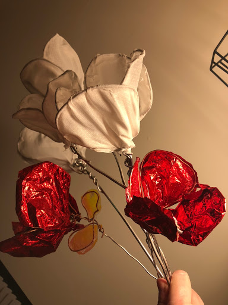
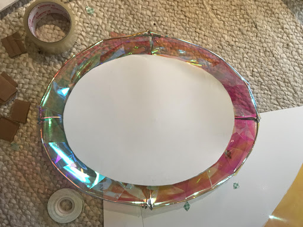
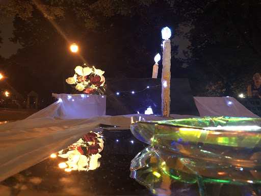
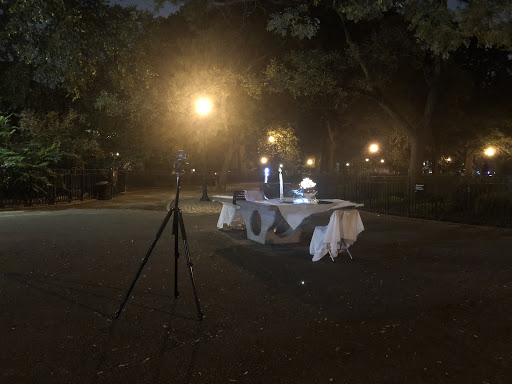
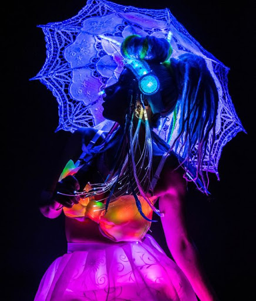
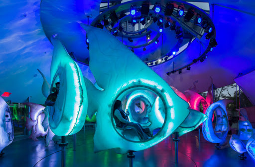
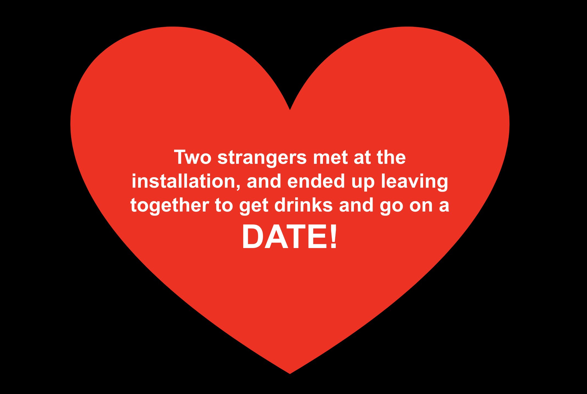

# Prototype Test III

## Public Date

The dining table set for two explores communication and the relationship between people at the table. The formal dining spread, like one would experience on a romantic date, is set in a dreamy, surreal, altered reality in an unexpected location. The larger-than-life objects and surrealist aesthetic invite the user into a dream-like situation. 

The reflective surfaces act as dividers in the center of the table, reflecting each individual’s side of the table and their own candle. This is a commentary on people’s preoccupation with playing with tech-devices and not being present in the company of others. Despite dining together at a table, each user is preoccupied with their remote control device and the isolation of their own reflection. 

## Changes Made for Prototype III:

-Roses made of wire, fabric, and cellophane. (Six roses in a vase.)

-Warm fairy lights added to vase with roses. 

-Placemats with mirror surface in addition to the reflective slanted dividers.

-Plates (giant sized) which we place the remote control inside of.

-Lights shining on the remote controls placed inside of the giant plates.

-We set up a tripod with an iPhone video camera to capture interactions. 

-No convos at all between us and the strangers until after they had experienced the interaction. 

[Prototype Test III Footage](https://drive.google.com/a/newschool.edu/file/d/1cQXJUC7T6oAbRj4ZPOUHZSVAOV_O99UG/view?usp=drivesdk)

## Reactions

“It’s very romantic and kind of witchy.” - Musician

“Are you having dinner or a seance?” -Single woman

“I’m confused...I accept it.” -Guy walking by in a large group with his friends

“It’s a social experiment. Is that what it is?” - A Parsons film student

“It’s really neat.” - Little boy, around six years old

“This is why we live in NYC. You won’t find this in Orange County.” -Little boy’s mother

## Style Feedback

EDM (Electronic Digital Music) festivals

The installation reminded someone of EDM (Electronic Digital Music) festivals where people incorporate glowing and light up fashion, jewelry, and accessories. 

Seaglass Carousel at Battery Park

We were also told that the project reminded someone else of the Seaglass Carousel at Battery Park which incorporates ambient music and glowing underwater scenery.

## Meaningfulness

-Most people were unaware of the rich jazz history of the location and were excited to learn about the historical connection to the installation. 

-The original game play function of the ping-pong table maintains its influence and a layer of meaning: responsive, playful back-and-forth. 

-The theme of communication and connection is highlighted through the metaphor of lighting the other person’s candle. 

-The reflective mirrors mimic the experience of isolation resulting from people’s obsessions with their gadgets - interrupting what was once quality time during dinner. 

-We created the experience and influence for kids of art and music.

## Future Ideas

We would love to be able to program objects on one end of the table to light up or react when objects on the other side are moved or picked up. Ideally we would incorporate motion sensors.
Making more objects for the table is our ideal vision. We want to incorporate the remote control functionality into a giant spoon. The size of the remote needs to be increased to be more noticable. It would ideally light up and be very prominent. We would like the remote control to be hidden in a piece of silverware so that it is more meaningful to the expected dining experience.

Bigger, more easily recognizable remote control buttons on the spoon (big red and green buttons) would be ideal as some people didn’t notice the buttons on the existing remote control. 
The range of the sensor for the existing remote control is very limited. People had to point directly at the divider. Ideally a sensor with a wider range would be used. 

## Reflection

I think our design style is gradually revealed more and more through the design iteration process. I really enjoy the way that individual artistic style appears throughout the prototyping stages. Learning about my own personal artistic style in this way is really illuminating and exciting to me. It feels like something of a mysterious process and one that requires faith and patience. It was really interesting too, to see what other people’s perceptions of the project were. My design partner, Jiangnan, and I had different approaches to implementation but a very unified vision for the project - so it was a very stimulating collaboration. 

One thing I learned during this project was that I have to really relax in the beginning during the design ideation phase and trust that putting in the work and effort will result in something I'm happy with. I had the most trouble with my anxiety in the stages before we had established a concept or form -  a very uncomfortable stage for me as someone who likes to know exactly what they're doing and why they're doing it. I learned that it's especially important for me to have faith during the process.  Our ideas seemed to start to flow once we solidified the concept, and I felt much more comfortable by that stage. 

When strangers interacted with the piece and rearranged objects on the table we decided that it looked good that way and maintained the changes. This was another example of "going with the flow" and being happily surprised by the outcome. Their redecorating then led to other strangers saying it reminded them of the isolation people experience due to their obsession with their tech devices – which was something we hadn’t thought of. That metaphor really resonated with us and we decided that we wanted to make that statement and cultural critique with our piece. 

I was also happy that the interaction of lighting the candle on the opposite side of the table came as a "delightful" and fun surprise for the people discovering it. They also seemed to find it funny which is something we had intended as well - that it was somewhat of an absurd/funny situation to have this romantic dinner for two in the middle of the park on a ping-pong table, controlling eachother's flame. It was fun to incorporate the Chet Baker song "Old Devil Moon" with lyrics about two candles. People were happy to learn about the history of music related to the project and seemed excited to learn about the historic house of Charlie Parker located a block away. 

The installation seemed to garner a lot of comments about people's appreciation of its beauty and the "romantic" element. (Those are definitely keys to my personal artistic voice.) I was happy that our goals of bringing out an emotional state of calm, enjoyment, beauty, and romance were easily recognizable and achieved. I am also really proud that our installation resulted in two people meeting, hitting it off, and going on a date. It was nice to see that the more we added objects to the table, the more easily people recognized what it was supposed to be. 

Our ideas had to be constrained to the limitations we were working within in terms of budget, time, and knowledge of programming/tech. Ideally, we would have loved to be able to program arduinos with motion sensors to incorporate into the installation. A big challenge was acknowledging our ideas were good, but in terms of the scope of our constraints we had to manage our goals. 

Jiangnan was a wonderful partner. She was especially great to work with and this was a really satisfying project to work on because she was such a creative, positive, and fun partner. We both contributed so many ideas and enthusiasm to making the project come to life and we were both very excited about it. We communicated really well and I felt very comfortable and at ease working with her. She was very creative and inspiring to work with. We did a lot of object crafting, making sculptures by hand, and painting. We also worked really well together as a team of two women, in a way that I think was unique. We really jumped in to help each other with things during every step of the project. 

Managing productivity in the context of the bigger picture is something that I have to keep in mind. I am very perfectionistic, and I could have spent an entire day making the roses out of wire and fabric look as beautiful as possible. I can get lost in the details of beautifying and perfecting things. This is something I love about art - but when working on this project I kept having to pull myself out of that state of mind and reframe my time management and task list in terms of the bigger picture objective. 

Something I didn’t expect was feedback about the vibe being “witchy” or like a “séance.” I personally take those interpretations as a compliment, because I am very much drawn to a witchy, magical style. I’m also a musician, and rockers are sort of known for occult-like mystical style so that's definitely something that makes sense to me. Rock stars like David Bowie and Jimmy Page were heavily interested in and influenced by “Magik” and the Occult. This is something I never really considered in terms of visual art or style, but I’m actually really excited about this feedback and the idea of consciously embracing this going forward. The comments we received comparing the installation to EDM festivals/rave fashion is also something that I used to be very into as a teen, which I’d forgotten about. It makes sense to me to hear that comparison drawn now, too, but wasn't something we consciously aimed for. 

The project highlighted my interest in the combination of audio and visual art. I loved tying the project to the location's jazz history. It was important to me to incorporate a musical element and to pay homage to the jazz history of the park, which I think gave it significantly deeper meaning. I am drawn to multi-modal art (different mediums used in tandem), especially visual art and music together as those are both my "mediums."

I thought a lot about why the idea of romance was so central to our concept. I mentioned the project to a friend, and explained that my artistic voice is "bloody romantic", whether I like it or not. I think this is definitely true in my poetry and songwriting, and I had never thought of it in terms of visual art, but it was interesting to me to see that it appeared so boldly in this project. We received a lot of feedback that the installation was "beautiful" and "pretty." At one point early on in our work I made a statement that "if it's not beautiful, no one will care about it." That made me reflect - is this a belief I have about myself in a larger sense? I also think that as an artist I am driven by something of an obsessive fixation or perfectionism to "beautify" tnings. Having "creative control" and beautifying things is like a meditative space for me to work in. This is something I'd like to explore and understand more from a psychological perspective as it relates to artists. 

I would love to learn about other artists who relate to these concepts of obsessiveness/beautification or who have explored similar themes. In the future I would also really like to continue to explore the relationship between visual art and music. I definitely would be excited to further research multi-modal artists and work which incorporates both music and visuals. I'm curious about other visual artists who are also musicians as well. I'm drawn to romantic and "magic/witch-like" art. My favorite genre of art across mediums is usually surrealist and dreamy. I would definitely like to research artists who explore music and visual art in a surrealist/magical way. 

