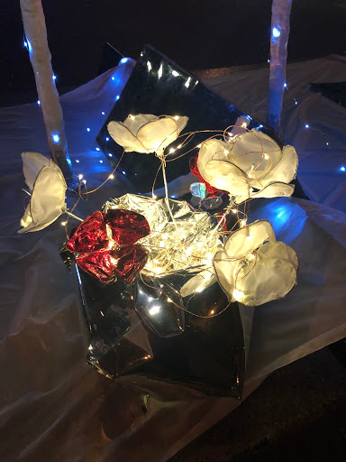

# Prototype Test III

## Public Date

The dining table set for two explores communication and the relationship between people at the table. The formal dining spread, like one would experience on a romantic date, is set in a dreamy, surreal, altered reality in an unexpected location. The larger-than-life objects and surrealist aesthetic invite the user into a dream-like situation. 

The reflective surfaces act as dividers in the center of the table, reflecting each individual’s side of the table and their own candle. This is a commentary on people’s preoccupation with playing with tech-devices and not being present in the company of others. Despite dining together at a table, each user is preoccupied with their remote control device and the isolation of their own reflection. 

## Changes Made for Prototype III:

-Roses made of wire, fabric, and cellophane. (Six roses in a vase.)

-Warm fairy lights added to vase with roses. 

-Placemats with mirror surface in addition to the reflective slanted dividers.

-Plates (giant sized) which we place the remote control inside of.

-Lights shining on the remote controls placed inside of the giant plates.

-We set up a tripod with an iPhone video camera to capture interactions. 

-No convos at all between us and the strangers until after they had experienced the interaction. 

[Prototype Test III Footage]( )

## Reactions

“It’s very romantic and kind of witchy.” - Musician

“Are you having dinner or a seance?” -Single woman

“I’m confused...I accept it.” -Guy walking by in a large group with his friends

“It’s a social experiment. Is that what it is?” - A Parsons film student

“It’s really neat.” - Little boy, around six years old

“This is why we live in NYC. You won’t find this in Orange County.” -Little boy’s mother

## Style Feedback

EDM (Electronic Digital Music) festivals

The installation reminded someone of EDM (Electronic Digital Music) festivals where people incorporate glowing and light up fashion, jewelry, and accessories. 

Seaglass Carousel at Battery Park

We were also told that the project reminded someone else of the Seaglass Carousel at Battery Park which incorporates ambient music and glowing underwater scenery.

## Meaningfulness

-Most people were unaware of the rich jazz history of the location and were excited to learn about the historical connection to the installation. 

-The original game play function of the ping-pong table maintains its influence and a layer of meaning: responsive, playful back-and-forth. 

-The theme of communication and connection is highlighted through the metaphor of lighting the other person’s candle. 

-The reflective mirrors mimic the experience of isolation resulting from people’s obsessions with their gadgets - interrupting what was once quality time during dinner. 

-We created the experience and influence for kids of art and music.

## Future Ideas

We would love to be able to program objects on one end of the table to light up or react when objects on the other side are moved or picked up. Ideally we would incorporate motion sensors.
Making more objects for the table is our ideal vision. We want to incorporate the remote control functionality into a giant spoon. The size of the remote needs to be increased to be more noticable. It would ideally light up and be very prominent. We would like the remote control to be hidden in a piece of silverware so that it is more meaningful to the expected dining experience.

Bigger, more easily recognizable remote control buttons on the spoon (big red and green buttons) would be ideal as some people didn’t notice the buttons on the existing remote control. 
The range of the sensor for the existing remote control is very limited. People had to point directly at the divider. Ideally a sensor with a wider range would be used. 

## Reflection

Style is revealed through process iteration and I really enjoy the way that personal style appears in the design process. I enjoy learning about my artistic style in this way. It was interesting too, to see what people’s perceptions of the project were. 

One thing I learned during this process was that you have to trust that if you put the work and effort into the design, something good will appear.  Our ideas seemed to start to flow and snowball once we solidified the concept. 

When strangers interacted with the piece and rearranged objects on the table we decided that it looked good that way and maintained the changes. Their redecorating then led to other strangers saying it reminded them of the isolation people experience due to their obsession with their tech devices – which was something we hadn’t considered.  That metaphor really resonated with us, and we decided that we wanted to make that statement.  

I was also happy that the piece spoke to people in terms of beauty and romance. Those are definitely key elements to my artistic voice, in any form. I was happy that our goals of bringing out an emotional state of calm, enjoyment, beauty, and romance were easily recognizable and achieved. I am also really proud that our installation resulted in two people meeting, hitting it off, and going on a date. 

My ideas for this project would have thrived on a budget of a couple thousand dollars and a time-frame of a few months, and with the knowledge of programming arduinos with time sensors. One challenge was acknowledging that all of the ideas we had were good, but in terms of the scope of the time allotted, budget, and our level of technical knowledge, we had to manage our expectations of ourselves. 

Jiangnin was a wonderful partner. This was a really satisfying project to work on because we both contributed so many ideas equally and were very excited about it. We communicated well and I felt very comfortable with her. She was very creative and inspiring to work with. We did a lot of object crafting, making sculptures by hand and painting, which is something that I’m really drawn to. I don’t know if that would have been as possible with another partner. We also felt very comfortable working together as two women in a way that I think was unique. (It was good to know we had eachother’s back when we were working in a park at night together too!) We really jumped in to help each other with things during every step of the project. 

Managing productivity/time-in the context of the bigger picture. I am very perfectionistic with artwork, and I could have spent an entire day making the roses out of wire and fabric look as beautiful as possible. I can get lost in the details. This is something I love about art, but when working on this project I kept having to pull myself out of that state of mind and reframe my time management and task completion in terms of the bigger picture objective. 

Something I didn’t expect was that multiple people commented that it was “witchy” or like a “séance.” I personally take those interpretations as a compliment, because I am very much drawn to a witchy, magical style. I would definitely describe my ideal artistic aesthetic as witchy, magical, supernatural, surrealist, dreamy, and romantic. I’m also a musician, so now that I think about it – those comments actually make a lot of sense to me. Rock stars like David Bowie and Jimmy Page were heavily interested in and influenced by mysticism, “Magik”, and the Occult. This is something I never really considered in terms of visual art or style, but I’m actually really excited about this feedback. 

The comments we received comparing the installation to EDM festivals/rave fashion is also something that I used to be very into as a teen, which I’d actually forgotten about. It makes sense to me to hear that comparison drawn now. The project highlighted my interest in the combination of audio and visual art. I loved tying the project to our historical location and the jazz history, and it was really important to me to incorporate a musical element. I think that I am very drawn to multi-modal art (different mediums used in tandem.) 

I thought a lot about why the idea of romance was so central to our concept. I mentioned the project to a friend, and explained that my artistic voice is "bloody romantic", whether I like it or not. I think this is definitely true in my poetry and songwriting, and I had never thought of it in terms of visual art but it was interesting to me to see that it appeared in this project. We received a lot of feedback that the installation was "beautiful" and "pretty." At one point early on in our work I made a commment that "if it's not beautiful, no one will care about it." 

That made me reflect - is that a belief I have about myself in a larger sense? Probably. I also think that as an artist I am driven by something of an obsession to "beautify" tnings, if that makes sense. This is something I'd like to understand more from a psychological perspective as it relates to artists. I would love to learn about other artists who relate to this concept or who have explored similar themes. In the future I would also really like to continue to explore the relationship between visual art and music. I definitely would love to further research multi-modal artists and work which incorporates both music and visuals. I'm drawn to romantic and "supernatural/magic" art as well. 

